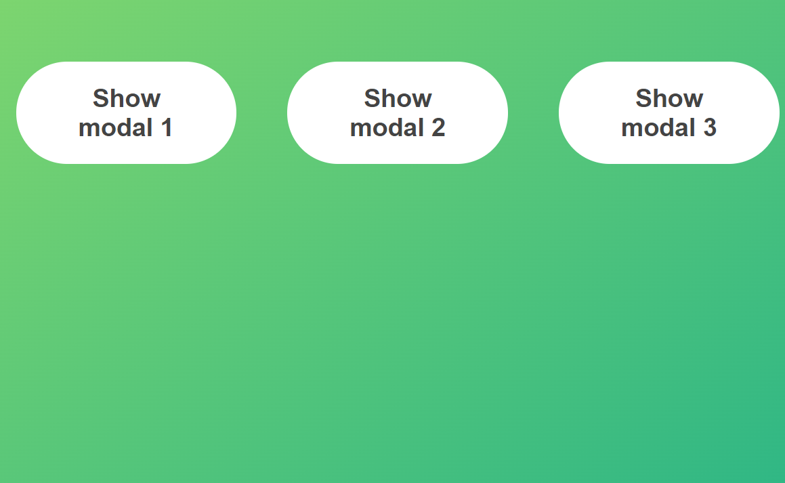
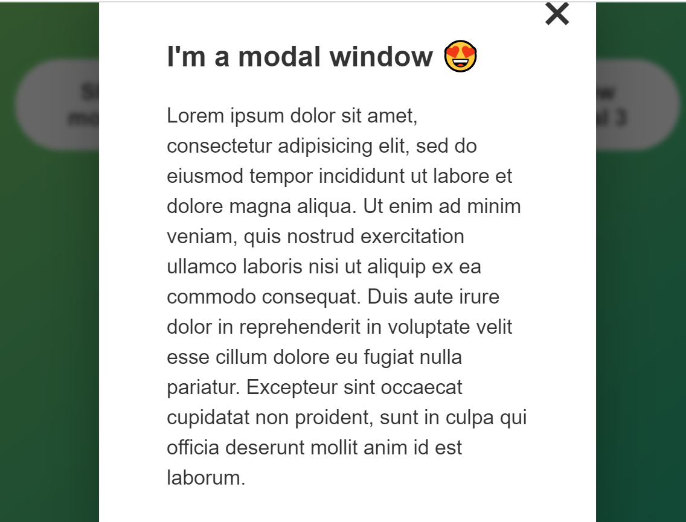

# ModalWindow

## This is a simple showcase of modal windown functionality based on JS.
* [Javascript](#Javascript)
* [Dom](#Dom)

## Features
* The message is triggered when the buttons are pressed.
* The message is closed when the close button or Esc is pressed.

## Sources
This app is inspired by [The Complete Javascript Course 2021](https://www.udemy.com)
